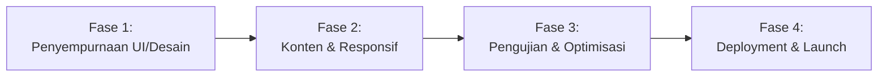

# Executive Summary  
Proyek situs Utama Global Indo Cargo sudah menggunakan **Next.js (App Router) + TypeScript**, Tailwind CSS, GSAP, Framer Motion, React-Three-Fiber dan Supabase untuk fitur backend. Struktur kode menunjukkan halaman home (Hero, layanan, penutup), halaman studi kasus (grid studi), dan halaman kontak (form multi-step). Fitur teknis utama—GL-Globe pada hero, horizontal scroll, animasi GSAP, form lead—sudah terbangun. Namun masih ada celah untuk mencapai tampilan *premium* ala buzzworthystudio.com: tata letak perlu diperhalus, tipografi dan warna distandarisasi, animasi dipadukan lebih agresif, serta konten (gambar, logo klien, studi kasus) diperkaya. Kami menyarankan daftar prioritas perbaikan (UI/UX, kode, performa) dengan tingkat effort dan risiko. Berdasarkan itu, kami susun **rencana implementasi berfase** untuk iterasi akhir menuju rilis: mulai dari penyempurnaan antarmuka/desain (Fase 1), pengembangan konten & responsivitas (Fase 2), optimisasi/periklanan teknis (Fase 3), hingga persiapan deployment & publikasi (Fase 4). Setiap fase disertai langkah-langkah detail (checklist) dan prompt siap pakai untuk Claude Code. Diagram alur fase dan tabel perbandingan visual disertakan sebagai referensi struktur.  

## 1. Kemajuan Proyek Saat Ini  
**Repo dan arsitektur:** Kode berada di folder Next.js “App Router” (folder `/src/app`). Terlihat sudah inisialisasi Next.js 16 + TypeScript, Tailwind CSS (via PostCSS), dan konfigurasi Supabase dengan `supabaseClient.ts` serta skema migrasi SQL untuk tabel *leads_prospect*. Struktur komponen cukup modular: ada `/components/layout` untuk layout umum (Hero, SmoothScroller, EasterEgg, dll), `/components/sections` untuk bagian horizontal scroll, contact form di `/components/contact`, studi kasus di `/components/case-studies`, dll. Skema navigasi minimal (tidak ada header global), tapi di layout terdapat elemen `SmoothScroller` (dipisah secara dinamis) untuk inersia scroll.  
  
**Stack Teknologi:** Berdasarkan `package.json`, teknologi meliputi Next.js, React 19.x, Tailwind CSS 4, GSAP & ScrollTrigger, Framer Motion, React Three (Three.js), Lenis (smooth scroll), React Hook Form + Zod, Supabase SDK. TypeScript terpasang. Tidak terlihat testing framework (Jest/Vitest) dalam `devDependencies`, jadi *test coverage* saat ini nol. Pipeline build adalah build Next biasa (`npm run dev/build`), belum ada CI/CD atau deployment pipeline terpasang (tidak ditemukan file seperti `vercel.json` atau GitHub Actions). Konfigurasi Next.js (`next.config.ts`) masih default kosong; Tailwind config belum ditemukan (perlu diperiksa agar warna kustom dikenali). Tailwind import via `globals.css` sudah mendefinisikan variabel kustom (`--color-logistics-orange: #ff4600; --color-carbon-dark: #111111;`), sesuai catatan awal. Lingkungan (env) mengatur URL dan key Supabase dengan placeholder.  

**Status halaman & komponen:** Halaman utama memiliki HeroSection (GL-Globe + animasi GSAP pada teks + CTA) dan ServicesHorizontal (scroll panel horizontal PAS framework), diakhiri satu section promosi. Halaman “Studi Kasus” menampilkan header dan `CaseStudyGrid` dinamis (memuat kartu studi kasus dengan modal detail). Halaman “Kontak” hanya berisi `ContactForm` multi-step dengan validasi Zod dan submit ke Supabase. Secara struktur, halaman utama belum ada nav atau footer; form kontak tidak menampilkan info alamat/telepon, fokus ke form lead capture. UI saat ini cenderung dark-mode di beberapa section (`bg-carbon-dark`), dengan tipografi futuristik Inter (bold/extrabold) dan warna aksen oranye (#ff4600). Aset grafis publik minim (hanya beberapa SVG logo), belum ada ilustrasi atau pola background kecuali globe WebGL.  

**Pipeline Build/Deploy:** Hanya script npm standar. Belum ada bundler optimization manual. Belum ada linting kustom selain `npm run lint` (Next ESLint). Contoh perintah yang tersedia:  

```bash
npm run dev       # menjalankan server Next.js
npm run build     # membangun untuk produksi
npm run lint      # verifikasi gaya kode
```  

**Dependencies & security/performance:** Semua dependensi terdaftar; perlu dicek versi terbaru (next 16, tailwind 4 sudah terbaru). Potensi masalah keamanan: tidak ada audit (harap jalankan `npm audit`). Supabase key di .env harus aman. Performa: Globe WebGL dan animasi GSAP/ScrollTrigger berat, tapi sudah di-SSR disable/dynamic import untuk HeroGlobe. Lenis integrasi sudah dipersiapkan untuk smooth scroll. Poin perhatian: ukuran bundle WebGL harus dipantau (kode split sudah diaktifkan), dan pengurangan unused tailwind penting (purge default Next sudah aktif). Tidak ada linting keamanan khusus, jadi pengecekan manual/codereview disarankan.  

> **Catatan:** Dokumentasi kemajuan di `PROGRESS.md` menyatakan “7 fase selesai 100%”, tapi analisis kode menunjukkan masih ada aspek yang perlu penyempurnaan (UI, konten, QA) sebelum publikasi.  

## 2. Kesenjangan Visual/UX vs. Target Buzzworthy  

| Aspek             | Implementasi Sekarang                   | Gaya Buzzworthy Studio【1†L18-L24】【1†L42-L49】       |
|-------------------|-----------------------------------------|-------------------------------------------|
| **Tata Letak**    | Linear/stack sederhana: hero – layanan – footer. Belum ada menu atau footer penuh; penggunaan *container* lebar (max-w-7xl) sudah baik. | Dinamis dan berlapis: teks besar tumpuk di hero (“Turn Vision into Value” dan sebaris motivasi)【1†L18-L24】, transisi antar-seksi interaktif. Layout tidak sekaku grid konvensional, sangat bebas dan kreatif. |
| **Tipografi**     | Inter Bold/Extrabold, konsisten, tapi relatif konvensional. Ukuran heading responsif. | Tipografi sangat ekspresif: teks judul super besar dengan kata terpecah; font futuristik high-contrast. Efek animasi teks (muncul berurutan, terjeda) menambah kesan dramatis. |
| **Warna & Kontras** | Tema awal: putih dan abu (light/dark mode), aksen oranye #ff4600. Saat ini banyak area gelap (`bg-carbon-dark`) dengan teks terang. | Latar cerah dan bersih mayoritas putih, teks hitam pekat; oranye digunakan untuk highlight. Kontras tinggi, feel segar. Tidak ada mode gelap otomatis. |
| **Animasi & Interaksi** | GSAP ScrollTrigger untuk text reveal, horizontal scroll interaktif, Globe WebGL. Smooth scroll (Lenis) siap diintegrasi. Indikator scroll animasi sederhana di hero. | Animasi kompleks: paralaks 3D halus, reveal teks bergeser, transisi halaman mulus. Buzzworthy bahkan menggunakan WebGL/Shader untuk efek “liquid distortion” dan transisi kelas atas (menurut analisis dokumen riset)【Analisis Buzzworthy】. Interaksi scroll-snap yang menggerakkan elemen secara sinkron lebih agresif. |
| **Grid & Responsif** | Tailwind grid standar; beberapa elemen (hero teks, tombol) terpusat. Horizontalscroll pakai flex full-width. Mobile: belum diuji penuh (divisi dua panel mungkin perlu stack). | Layout fluid, memanfaatkan full-bleed sections. Antar layout dekstop/small screen transisi halus (pindah grid), kemungkinan reflow. Scalable ke mobile dengan adaptasi layout (disebutkan “riilokasi UI untuk layar sempit”). |
| **Aset Grafis**   | Globe 3D, ikon/logo klien (jika ada), pola SVG minimal. Branding aset belum lengkap (tanpa ilustrasi custom). | Banyak ilustrasi vektor/background (misal pola hexagon top). Logo klien dan statistik animatif (ikon anak panah naik dll). Efek visual kaya grafis latar untuk menekankan angka (Bounce Rate, dsb). |
| **Semangat & Narasi** | Fokus pesan B2B (visi operasi) belum se-dramatis Buzzworthy. CTA sederhana (“Jelajahi Kapabilitas”). | Tone penuh semangat (“unlock potential”, “amplify your message”). Gaya cerita kuat: penyisipan klien premium dan testimoni (membangun kredibilitas). Penuh optimisme dan futuristik【1†L42-L49】. |

Secara ringkas, implementasi saat ini sudah memasukkan konsep utama (GL-Globe, horizontal scroll, oranye #ff4600) namun masih terbilang *prototipe*—masih sederhana dan kurang lapisan visual dibanding situs inspirasi. Buzzworthy menonjol dengan **tipografi dan animasi dramatis** serta konten dinamis (gambar klien, grafik angka, video/3D). Situs kita perlu ditingkatkan pada elemen estetika tersebut: susunan teks lebih kreatif, animasi lebih tajam, dan aset kaya (ilustrasi, ikon) lebih banyak. Contohnya, Buzzworthy menampilkan tajuk raksasa bertingkat seperti “Turn Vision into Value”【1†L18-L24】 sedangkan di hero saat ini teks cukup sederhana. 

## 3. Rekomendasi Perbaikan Teknis & Desain (Prioritas)  

Berikut daftar perbaikan utama, diurutkan berdasarkan dampak prioritas. Setiap item diberi *effort* (rendah/menengah/tinggi) dan *risiko* (rendah/menengah/tinggi):

- **Penyempurnaan Tata Letak & Responsif (Effort: Medium, Risiko: Rendah).**  
  - *Desain adaptif mobile*: Pastikan layout horizontalscroll & hero responsif (mis. panel menyusun vertikal di mobile). Uji di berbagai breakpoints.  
  - *Tambah navigasi/footer*: Implementasikan header minimal dengan logo/menu (bisa sticky) dan footer ringkas (kontak, copyright). Ini memperbaiki UX dan konsistensi.  

- **Pemakaian Tipografi & Warna Konsisten (Effort: Low, Risiko: Rendah).**  
  - *Tailwind config & CSS variables*: Perbaiki `tailwind.config` agar kelas warna (misal `bg-logistics-orange`, `bg-carbon-dark`) otomatis tersedia. Contoh patch (tailwind.config.js):  
    ```js
    /** @type {import('tailwindcss').Config} */
    module.exports = {
      theme: {
        extend: {
          colors: {
            'logistics-orange': '#ff4600',
            'carbon-dark': '#111111',
          },
        },
      },
      // ...
    };
    ```  
  - *Tipografi ekspresif*: Perbesar ukuran judul di hero sesuai gaya (mis. >4xl), gunakan transform teks (mis. stroke/pattern) jika perlu. Sesuaikan jarak huruf (tracking) untuk efek futuristik.  
  - *Skema warna*: Pertimbangkan dominasi latar terang (seperti Buzzworthy) lalu sesuaikan teks/dark mode manual. Saat ini dark-light mode otomatis bisa membingungkan brand image.  

- **Penambahan Aset Grafis & Brand (Effort: Medium, Risiko: Rendah).**  
  - *Ilustrasi latar/pola*: Tambahkan elemen dekoratif (mis. pola hexagon top) untuk kedalaman visual (lihat [hexagon pattern] pada Buzzworthy【1†L14-L20】).  
  - *Logo mitra & klien*: Siapkan slider atau grid logo klien teratas untuk meningkatkan trust (Buzzworthy menampilkan logo perusahaan besar【1†L122-L131】).  
  - *Statistik animatif*: Jika relevan, tambahkan counter animasi (contoh nilai metrik ROI) untuk dinamika.  

- **Optimalisasi Animasi (Effort: High, Risiko: Medium).**  
  - *Lengkapi integrasi Lenis + GSAP*: Pastikan smooth scrolling (`SmoothScroller`) sudah teruji. Sesuaikan `ScrollTrigger` untuk semua elemen (hero teks, panels) setelah Lenis aktif.  
  - *Pengoptimalan WebGL*: Ukur FPS Globe 3D; jika berat, turunkan level detail (lod) atau nonaktifkan di perangkat rendah-end. Pertimbangkan placeholder statis jika device tidak mendukung.  
  - *Tambah transisi halus antar-seksi*: Bisa implementasi efek overlay atau paralaks sederhana antara bagian (misal fade out/in background saat scroll).  

- **Konten & Copywriting (Effort: Medium, Risiko: Rendah).**  
  - *Lengkapi konten bahasa*: Saat ini sebagian besar placeholder. Susun copy sesuai studi kasus nyata dan uraian layanan. Gunakan bahasa korporat persuasif (seperti case study template sudah ada).  
  - *CTA lebih menarik*: Misalnya ganti “Jelajahi Kapabilitas” dengan kata-kata tindakan yang lebih kuat. Tambah subjudul yang bersahaja tapi fokus hasil.  
  - *SEO & Metadata*: Verifikasi metadata SEO (telah disiapkan), tambahkan alt teks untuk semua gambar (snippet perbaikan):  
    ```diff
    - 
    + 
    ```  

- **Pengujian & Kualitas Kode (Effort: Medium, Risiko: Medium).**  
  - *Linting dan TypeScript*: Pastikan tidak ada peringatan ESLint/TS. Tambahkan pre-commit hook (Husky) untuk `lint`.  
  - *Unit/E2E Tests*: Mulai tambahkan minimal unit test (Vitest + Testing Library) untuk komponen penting (HeroSection, ContactForm). Contoh perintah linting/test:  
    ```bash
    npm run lint          # cek gaya kode
    npm test             # (setelah setup) jalankan test suite
    ```  
  - *Audit keamanan*: Jalankan `npm audit` dan perbaiki kerentanan paket. Validasi input form pada backend (supabase sudah menangani JSON B, tapi sanitasi API tetap penting).  

- **Pipeline & Infrastruktur (Effort: Low, Risiko: Rendah).**  
  - *Continuous Integration*: Konfigurasikan pipeline (GitHub Actions/Vercel) untuk build otomatis.  
  - *Pengaturan deployment*: Siapkan `next.config.js` jika perlu (contoh: aktifkan `output: 'standalone'` untuk Docker, konfigurasi domain external untuk gambar).  
  - *Domain & Hosting*: Karena belum ditentukan, rekomendasikan Vercel/Netlify (Next friendly) lalu update `NEXT_PUBLIC_` env.  

Setiap perbaikan di atas sebaiknya dicentang dalam backlog. Usahakan menyelesaikan yang berdampak tinggi dulu (animasi & tata letak), lalu fitur pendukung (konten, testing).

## 4. Rencana Implementasi Bertahap  

Berikut rancangan fase proyek menuju siap-publish. Setiap fase disertai tujuan, deliverable, estimasi waktu, dependensi, dan daftar langkah (checklist). Di akhir setiap fase, disertakan contoh *prompt* yang siap pakai untuk Agen Claude Code melanjutkan pekerjaan.

| Fase  | Tujuan Utama                          | Deliverable           | Estimasi Waktu | Dependensi         | Status Checklist  |
|-------|---------------------------------------|-----------------------|---------------|--------------------|-------------------|
| **1. Penyempurnaan Desain**    | Aligment UI dengan gaya target (layout, tipografi, warna)  | Hero & Services yang di-update, style guide, CSS var aktif | 1–2 minggu  | Desain Buzzworthy, Tailwind config | 🔲 On Progress |
| **2. Konten & Responsivitas**  | Lengkapi konten halaman, optimalkan untuk mobile  | Tambahan gambar/ilustrasi, nav/footer, konten studi kasus lengkap | 1–2 minggu  | Fase 1 selesai | 🔲 Pending |
| **3. Pengujian & Optimisasi**  | Periksa kualitas & performa, perbaiki bugs  | Unit/E2E test, perbaikan bug, audit keamanan, Lighthouse score naik | 1 minggu | Fase 2 selesai | 🔲 Pending |
| **4. Deployment & Launch Prep** | Siapkan CI/CD dan publish site  | Konfigurasi hosting, domain, final review, SEO siap rilis | 3–5 hari | Fase 3 selesai | 🔲 Pending |

### Fase 1: Penyempurnaan Desain  
**Langkah (Checklist):**  
- [ ] _Tata letak hero dan konten_: Tingkatkan skala teks hero (contoh: `text-6xl md:text-8xl`), atur jarak spasi. Pertimbangkan efek teks terpotong (CSS `overflow-hidden`, mask).  
- [ ] _Integrasi pola/background_: Tambah elemen grafis (misal pola SVG hexagon di lapisan atas/bawah hero).  
- [ ] _Header & Footer_: Buat komponen header dengan logo + menu anchor (smooth scroll ke #layanan/#kontak), dan footer dengan kontak ringkas.  
- [ ] _Warna konsisten_: Pindahkan variabel CSS ke `tailwind.config` (seperti contoh patch di atas). Pastikan kelas Tailwind baru (bg-logistics-orange, bg-carbon-dark) berfungsi.  
- [ ] _Cek dark/light mode_: Tentukan apakah gunakan dark mode atau hanya terang saja. Update CSS global jika perlu (misal disable prefer dark).  
- [ ] _Verifikasi desain vs target_: Bandingkan dengan layout Buzzworthy (cocokkan jarak konten, ukuran teks). Gunakan Tabel Perbandingan Visual sebagai acuan.  

**Prompt untuk Claude Code (Fase 1):**  
```
Sebagai Claude Code, fokuslah pada penyempurnaan UI/UX sesuai gaya situs inspirasi Buzzworthy Studio. Tingkatkan tata letak hero dan section layanan: perbesar tipografi, tambahkan latar belakang pola, serta buat komponen header/footer sederhana. Atur varian warna Tailwind (oranye #ff4600, gelap #111111). Pastikan elemen responsif. Output berupa patch kode Next.js (React/Tailwind) dan konfigurasi terkait.
```

### Fase 2: Konten & Responsivitas  
**Langkah (Checklist):**  
- [ ] _Lengkapi konten studi kasus_: Tambahkan lebih banyak caseStudy di `caseStudiesData.ts` beserta gambar/logo klien (gunakan komponen grid/modal).  
- [ ] _Gambar & ikon_: Sisipkan ilustrasi atau foto yang relevan (pastikan optimasi format/webp). Tambahkan atribut `alt` pada semua gambar.  
- [ ] _Responsivitas menyeluruh_: Uji di mobile; sesuaikan flex/grid (contoh: ubah arah panel horizontal menjadi vertikal di width kecil).  
- [ ] _Form multi-step_: Verifikasi alur form kontak (pergantian step, progress bar). Perbaiki jika ada glitch styling/validasi.  
- [ ] _Meta & SEO_: Review metadata (title, description sudah ada). Tambah sitemap atau robots.txt jika perlu.  
- [ ] _Testing UI dasar_: Jalankan `npm run dev` dan coba navigasi setiap halaman. Perbaiki error console.  

**Prompt untuk Claude Code (Fase 2):**  
```
Lanjutkan dengan pengembangan konten dan peningkatan responsivitas. Tambahkan data studi kasus (seperti contoh), masukkan gambar/ikon sesuai branding. Uji dan perbaiki tampilan untuk perangkat mobile. Pastikan form kontak multi-step berfungsi di semua ukuran layar. Berikan patch React/Tailwind beserta langkah konfigurasi (misal optimasi gambar, update metadata).
```

### Fase 3: Pengujian & Optimisasi  
**Langkah (Checklist):**  
- [ ] _Linting dan Type Check_: Jalankan `npm run lint`; perbaiki segala peringatan. Tambahkan skrip pre-commit jika perlu.  
- [ ] _Unit Test_: Buat test dasar (mis. Vitest/Jest) untuk komponen kritikal (HeroSection, ContactForm). Contoh perintah: `npm install -D vitest @testing-library/react` lalu `npx vitest`.  
- [ ] _Performance Audit_: Gunakan Lighthouse (Chrome DevTools) atau `next build && next start` untuk mengukur skor performa (FCP, TTFB). Perbaiki gambar besar, lazy load, dll.  
- [ ] _Keamanan_: Jalankan `npm audit fix`. Pastikan inputs API disanitasi. Tes penyisipan payload di form kontak.  
- [ ] _Smoke Test End-to-End_: (Opsional) Buat test e2e ringan (Playwright/Cypress) untuk flow utama: load home, scroll, isi form kontak.  

**Prompt untuk Claude Code (Fase 3):**  
```
Sekarang lakukan pengujian dan optimisasi. Tambahkan unit test untuk komponen penting, jalankan lint dan perbaiki peringatan. Audit keamanan (gunakan `npm audit`). Berikan skrip tambahan (package.json) dan instruksi setup untuk testing. Sertakan snippet perintah build/test.
```

### Fase 4: Deployment & Publikasi  
**Langkah (Checklist):**  
- [ ] _CI/CD_: Setup pipeline di GitHub Actions atau platform hosting (mis. workflow build & deploy Next.js).  
- [ ] _Konfigurasi Hosting_: Pilih penyedia (Vercel/Netlify/Platform lain). Sesuaikan env vars (Supabase).  
- [ ] _Domain_: Catat proses untuk custom domain (DNS, SSL). Buat file `vercel.json` atau pengaturan serupa jika perlu.  
- [ ] _Final Review_: Final check UI, run end-to-end. Perbaiki issue terakhir.  
- [ ] _Publikasi_: Deploy ke production, monitoring awal (cek error logs). Pastikan backup DB (jika menggunakan production Supabase).  

**Prompt untuk Claude Code (Fase 4):**  
```
Siapkan pipeline dan deployment. Tulis konfigurasi GitHub Actions atau Vercel untuk build/publish Next.js. Sediakan contoh `next.config.js` untuk optimasi (misalnya `output: 'standalone'`). Instruksikan cara men-setup domain. Berikan langkah pengujian pasca-deploy.
```



**Tabel Ringkasan Per Fase:** Disajikan di atas sebagai referensi **goal, deliverable, waktu, dependensi**, dan status (berisi checklist). 

Demikian analisis komprehensif. Prioritaskan penyempurnaan yang berfokus pada gap visual utama dan pengalaman pengguna terlebih dahulu, lalu simpan tugas pengujian/optimasi untuk fase selanjutnya. Semua prompt sudah siap pakai untuk meneruskan pengerjaan dengan Claude Code.  

**Sumber:** Kode repositori proyek (struktur & Progress.md), dokumen analisis riset, dan situs referensi buzzworthystudio.com【1†L18-L24】【1†L42-L49】.